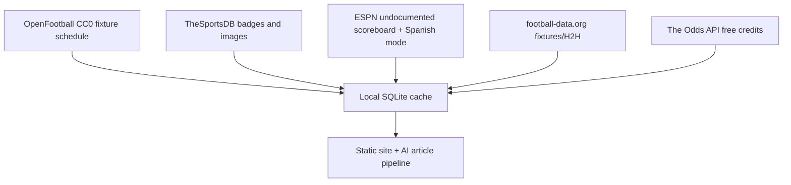

# Football API Strategy Report for `eolvera2/2026-wc-quiniela`

**Prepared:** June 2026  
**Scope:** best football data API strategy for WC 2026 quiniela / prediction pages across all phases: fixtures, teams, status, scores, odds/momios, form, H2H, injuries, lineups, extended betting markets, Spanish/Mexican audience.

## Executive Summary

The best overall recommendation is **API-Football / API-Sports direct** as the primary provider, not API-Football through RapidAPI. It is the best fit because the current codebase is already written against API-Football response shapes, it covers the exact required data domains, and switching from RapidAPI to direct API-Sports is a small URL/header change rather than a provider rewrite.[^1][^2]

The cheapest stable production path is: **API-Football direct paid tier during WC 2026**, plus optional free enrichments from **OpenFootball** for static fixture backup and **TheSportsDB** for images/team badges.[^3][^4] A fully free stack is possible for fixture/status/score/odds prototypes using ESPN undocumented endpoints, OpenFootball, TheSportsDB, football-data.org, and The Odds API free credits, but it is not reliable enough as the production data backbone for a monetized affiliate site because ESPN is unofficial and free sources do not consistently provide injuries or predicted/confirmed lineups.[^5][^6]

For price/quality, the practical ranking is:

1. **API-Football direct** — best value single API for this repo.
2. **SportMonks Starter + Odds add-on** — best polished one-vendor alternative, but more expensive.
3. **API-Football direct + The Odds API** — best if odds depth becomes more important than single-provider simplicity.
4. **OpenFootball + TheSportsDB + ESPN** — best zero-cost demo/fallback stack, not ideal for commercial production.
5. **Sportradar / Opta / Stats Perform** — highest quality, but enterprise-only and out of budget.

## Current Codebase Data Requirements

The current repository is already API-Football-shaped. It consumes:

| Current requirement | Current endpoint | Fields used |
|---|---|---|
| Fixtures, teams, venues, status | `/fixtures?league={leagueId}&season={season}` | fixture ID, kickoff UTC, status, venue, round, home/away IDs, names, logos |
| Team form and aggregate goals | `/teams/statistics?team={teamId}&league={leagueId}&season={season}` | form, goals for, goals against, raw stats JSON |
| 1X2 odds / momios | `/odds?fixture={fixtureId}` | bookmaker name, home/draw/away odds |

The current parser only extracts the `Match Winner` market, so Phase 2 betting pages will need odds-market parsing for over/under, BTTS, cards, corners, and player props.[^7]

The planned article types imply additional requirements:

| Phase | Article type | Additional data needed |
|---|---|---|
| v1 | `pronostico_momios` | fixtures, form, H2H, odds, injuries if available |
| v2 | `alineacion_probable` | injuries, absences, squads, predicted/confirmed lineups |
| v2 | `quiniela_verdict` | H2H, form, outcome/framing data |
| v2 | `analisis_apostar` | over/under, cards, player props, odds movement, historical trends |

Important code gaps exist regardless of provider:

- **H2H table exists but no ingest implementation exists yet.** The generation layer reads H2H, but the table is never populated.[^8]
- **Injuries are currently a hardcoded stub.** `getInjuries()` returns “No injury data available.”[^9]
- **Lineups are not in the schema or ingest layer.**
- **Scores/results are not persisted as `home_score` / `away_score`, even though outcome tracking is planned.**
- **Odds snapshots are overwritten, so 24–48h odds movement cannot be measured without schema changes.**

## Provider Comparison

| Provider | Best use | Price/value | WC 2026 fit | Odds | Lineups | Injuries | H2H/Form | Commercial suitability |
|---|---|---:|---|---|---|---|---|---|
| **API-Football direct / API-Sports** | Primary all-in-one API | **Best** | Strong | Yes | Yes | Yes | Yes | Good for affiliate display/AI context |
| **API-Football via RapidAPI** | Same data through marketplace | Worse than direct | Strong | Yes | Yes | Yes | Yes | OK, but unnecessary middleman |
| **SportMonks** | Polished premium alternative | Good but higher cost | Strong | Add-on | Yes | Yes | Yes | Strong |
| **The Odds API** | Dedicated odds layer | Excellent for odds | Strong for odds | Strong | No | No | No | Strong |
| **football-data.org** | Fixtures, scores, standings, H2H | Good/free for basics | Good | No | Paid/limited | No | Some | Strong |
| **OpenFootball** | Static fixture fallback | Excellent/free | Strong static schedule | No | No | No | No | Excellent CC0 |
| **TheSportsDB** | Logos, badges, imagery, metadata | Good/free or cheap | Good | No | No/unclear | No | Limited | Good for web use |
| **ESPN undocumented API** | Free prototype/enrichment | High data, low guarantees | Strong currently | DraftKings odds | No confirmed stable lineups | No | Form/status/scores | ToS/stability risk |
| **Sportradar / Opta / Stats Perform** | Official/enterprise feed | Too expensive | Excellent | Yes | Yes | Yes | Yes | Enterprise contracts |

## Recommendation 1: API-Football Direct as Primary

Use **API-Football direct through API-Sports** as the main provider. The current repo is already aligned with API-Football’s v3 schema, so this minimizes implementation risk while covering fixtures, standings, status, scores, team stats, odds, H2H, lineups, injuries, squads, and predictions.[^1][^2]

Use the direct API endpoint:

```text
https://v3.football.api-sports.io
```

with:

```text
x-apisports-key: <API_FOOTBALL_KEY>
```

instead of the RapidAPI endpoint:

```text
https://api-football-v1.p.rapidapi.com/v3
X-RapidAPI-Key: <RAPIDAPI_KEY>
X-RapidAPI-Host: api-football-v1.p.rapidapi.com
```

The endpoint paths and response envelope are effectively the same, so migration is low-risk: update the base URL, auth header, environment variable naming, and maybe rate-limit header handling.[^10]

### Why direct instead of RapidAPI?

- Same underlying API and response shapes.
- Lower marketplace overhead at paid tiers.
- Cleaner authentication (`x-apisports-key` only).
- Better long-term ownership of billing and support.

### Cost guidance

Exact public API-Sports pricing was difficult for subagents to verify because the pricing page is JS-rendered / sometimes blocked, but multiple current developer references consistently place the useful entry paid tier around the low tens of dollars per month, with common references to **~$19/month** and substantially more request budget than this project needs.[^11] Verify the live price in `dashboard.api-football.com` before buying.

The free tier may be useful for development, but relying on it for WC 2026 production is risky: some research found current-season/future-season restrictions on free plans and the quota leaves little room for development mistakes.[^12]

## Recommendation 2: Optional Odds Enrichment with The Odds API

If Phase 2 betting content needs deeper odds coverage than API-Football provides, add **The Odds API** as a dedicated odds source. It is odds-only, but it has a transparent free/paid credit model and strong bookmaker coverage for global markets.[^13]

Use it only if:

- API-Football odds do not expose enough markets for `analisis_apostar`.
- You want more bookmaker coverage or cleaner odds snapshots.
- You need reliable over/under, spreads, and market refreshes independent of the football stats provider.

Do not use The Odds API as the primary provider because it does not provide lineups, injuries, team form, H2H, standings, or fixture context.

## Free and Low-Cost Fallback Stack

A useful zero-cost fallback/demo stack is:



Recommended roles:

- **OpenFootball**: bootstrap the 104-match WC 2026 schedule and stadium data; safest legal source due to CC0-style open data.[^3]
- **TheSportsDB**: team badges, event images, and metadata; useful for improving article/page presentation.[^4]
- **ESPN undocumented API**: strong free source for scoreboard, Spanish labels (`?lang=es`), status, form, and DraftKings odds, but not contractually reliable and not ideal as a monetized commercial backbone.[^5]
- **football-data.org**: stable fixtures, scores, standings, H2H; not a full betting/prediction source because it lacks odds and injuries.[^6]
- **The Odds API free tier**: good for low-volume odds experiments; not a complete football stats API.[^13]

This stack is good for demos, backup, and enrichment, but not enough for the full Phase 2 vision because no reliable free source consistently covers **injuries + predicted/confirmed lineups + odds markets** with production-grade terms.

## SportMonks Alternative

SportMonks is the strongest non-API-Football paid alternative. It has polished docs, broad football coverage, lineups, injuries, H2H, statistics, and optional odds/predictions add-ons.[^14]

Choose SportMonks if:

- You want better documentation/developer experience.
- You value a more polished product over lowest cost.
- You want Spanish/localization support through translations.
- You are comfortable with league-slot limits and add-on pricing.

For this specific repo, SportMonks is a second choice because switching would require a provider adapter and response mapping rewrite, whereas API-Football direct mostly preserves the existing integration.

## Enterprise Providers

Sportradar, Opta / Stats Perform, and similar enterprise feeds are the most authoritative sources and often have official sports-data relationships, but they are not appropriate for this project’s current budget. They typically require sales contracts and can run into five-figure annual costs.[^15]

Use them only if the project becomes a funded media/business operation requiring official rights, SLAs, and advanced tactical feeds.

## Migration Plan for This Repo

### Phase 1 — Switch RapidAPI to API-Sports Direct

1. Add new env var:

```text
API_FOOTBALL_KEY=<direct API-Sports key>
```

2. Change API host constants in:

- `src/ingest/fixtures.js`
- `src/ingest/teams.js`
- `src/ingest/odds.js`

from RapidAPI host/base URL to:

```text
https://v3.football.api-sports.io
```

3. Change headers from:

```js
{
  'x-rapidapi-key': rapidApiKey,
  'x-rapidapi-host': 'api-football-v1.p.rapidapi.com'
}
```

to:

```js
{
  'x-apisports-key': apiFootballKey
}
```

4. Keep parsing logic the same initially, because endpoint paths and response envelopes match.

5. Keep the current 1 req/sec limiter until real tier limits are known; then tune based on direct API rate-limit headers.[^16]

### Phase 2 — Fill Current Data Gaps

Implement these before enabling additional article types:

1. `src/ingest/h2h.js` for `/fixtures/headtohead`.
2. `src/ingest/injuries.js` for `/injuries`.
3. `src/ingest/lineups.js` for `/fixtures/lineups`.
4. Schema tables for injuries, lineups, players/squads, match scores.
5. Odds market parsing for over/under, BTTS, cards, corners, and player props.
6. Odds snapshots table for movement tracking.

### Phase 3 — Provider Adapter

Before adding any secondary provider, introduce a thin provider interface:

```text
FootballDataProvider
  fetchFixtures()
  fetchTeamStats()
  fetchOdds()
  fetchH2H()
  fetchInjuries()
  fetchLineups()
```

Then implement:

- `ApiFootballProvider` as primary
- optional `OpenFootballProvider` for static fallback
- optional `TheSportsDbProvider` for images
- optional `OddsApiProvider` for odds enrichment

## Request Volume Estimate

WC 2026 has **104 matches**, not 64. A smart sync pattern keeps volume low:

| Data task | Approx. calls |
|---|---:|
| One-time fixture import | 1 |
| Team stats / form for 48 teams | ~48 |
| H2H per matchup | ~104 |
| Odds seed/refresh/lock | ~200–300 |
| Lineups close to kickoff | ~104 |
| Injuries periodic refresh | ~20–50 |
| Post-match stats/events/scores | ~200–400 |
| **Tournament total** | **~700–1,000+ calls** |

Even with development overhead and repeated retries, this is modest for any real paid tier. It is annoying on a 100/day free plan but comfortable on a low paid plan.

## Final Recommendation

Use:

```text
Primary provider: API-Football direct / API-Sports
Billing path: direct dashboard, not RapidAPI
Production tier: lowest paid tier that includes WC 2026 current-season data, odds, injuries, and lineups
Fallback/enrichment: OpenFootball + TheSportsDB
Optional odds upgrade: The Odds API if API-Football odds markets are insufficient
```

This gives the best balance of **implementation speed, data completeness, reliability, and price** for the current repo. It avoids a rewrite, supports all planned article phases, and lets you start with the mock/static deployment you already have while moving toward real API-backed content.

## Confidence Assessment

**High confidence**

- The repo is already built around API-Football response shapes and endpoints.
- API-Football direct is the lowest-friction production path.
- The current code is missing H2H ingest, injuries, lineups, extended odds parsing, score persistence, and odds snapshots.
- Free/open sources are valuable as fallback/enrichment but do not fully replace a paid production provider for Phase 2.

**Medium confidence**

- Exact API-Football paid tier names/prices, because the pricing page can be JS-rendered/blocked and should be verified at signup time.
- Availability/quality of injury and lineup data specifically for national-team tournaments, which can be patchier than club data.
- Bookmaker availability for Mexican-market brands such as Caliente; no research source confirmed Caliente as available through mainstream APIs.

**Low confidence / requires verification with a real key**

- Exact bookmaker IDs/markets exposed for WC 2026 in API-Football.
- Whether the `/predictions` endpoint covers every WC 2026 fixture.
- Exact current-season restrictions on API-Football free tier at the moment of signup.

## Footnotes

[^1]: `eolvera2/2026-wc-quiniela:src/ingest/fixtures.js:53-88` — current fixture ingest uses API-Football-style `/fixtures` response fields.
[^2]: `eolvera2/2026-wc-quiniela:src/ingest/teams.js:16-30` and `src/ingest/odds.js:20-57` — current team statistics and odds ingest are written for API-Football endpoint shapes.
[^3]: OpenFootball project: https://github.com/openfootball/worldcup — subagent verified WC 2026 schedule files and CC0-style reuse suitability.
[^4]: TheSportsDB documentation and pricing: https://www.thesportsdb.com/documentation and https://www.thesportsdb.com/pricing — subagent verified WC 2026 fixture metadata and image/badge utility.
[^5]: ESPN undocumented scoreboard pattern: `https://site.api.espn.com/apis/site/v2/sports/soccer/fifa.world/scoreboard`; subagent verified Spanish mode via `?lang=es` and embedded DraftKings odds but flagged Disney ToS/commercial automation risk.
[^6]: football-data.org documentation: https://www.football-data.org/documentation/api — useful for fixtures/scores/standings/H2H, but no odds or injury feed.
[^7]: `eolvera2/2026-wc-quiniela:src/ingest/odds.js:36-57` — only `Match Winner` is extracted and stored.
[^8]: `eolvera2/2026-wc-quiniela:src/db/schema.sql:44-51` and `src/generate/batch.js:112-120` — H2H table and reader exist, but subagent found no `src/ingest/h2h.js`.
[^9]: `eolvera2/2026-wc-quiniela:src/generate/batch.js:123-125` — injuries are currently a hardcoded stub.
[^10]: API-Football direct documentation: https://www.api-football.com/documentation-v3 — direct auth uses `x-apisports-key`; RapidAPI uses `X-RapidAPI-Key` and `X-RapidAPI-Host`.
[^11]: API-Football pricing page: https://www.api-football.com/pricing — subagents reported public pricing page access was partially blocked/JS-rendered; multiple developer references cited low paid tiers around ~$19/month.
[^12]: Subagent cited current developer test fixtures showing free-plan season restrictions such as “Free plans do not have access to this season…”; verify in API-Sports dashboard before relying on free tier.
[^13]: The Odds API pricing/docs: https://the-odds-api.com/#pricing and https://the-odds-api.com/liveapi/guides/v4/ — odds-only provider with free credits and paid plans.
[^14]: SportMonks Football API and odds docs: https://www.sportmonks.com/football-api/ and https://docs.sportmonks.com/football/ — subagent verified lineups, injuries, H2H, stats, translations, and odds add-ons.
[^15]: Sportradar / Stats Perform public sites: https://sportradar.com and https://www.statsperform.com — enterprise providers; no low self-serve pricing surfaced.
[^16]: `eolvera2/2026-wc-quiniela:src/ingest/rateLimiter.js:14` — current limiter defaults to 1000ms minimum interval.
